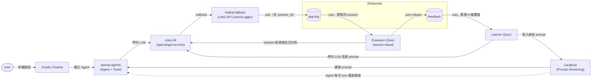
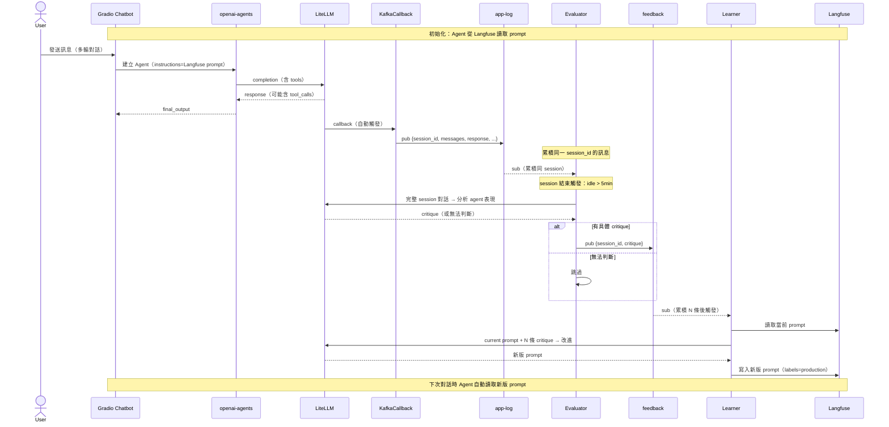

# Prompt Learning Flywheel — POC Plan

## 目標

驗證「LLM application 可以透過自動化流程持續改進自身 prompt」這個概念。

~~Demo 場景：客服對話 → 結構化 JSON 擷取。初始 prompt 粗糙，flywheel 跑數輪後，prompt 自動演化，輸出品質可觀察地提升。~~

Demo 場景（v2）：多輪對話客服 agent，具備 tool calling 能力（轉人工、查訂單、退款）。初始 prompt 故意粗糙，flywheel 透過 session-based evaluation 自動改進 agent 的對話品質。Prompt 版本控制由 Langfuse 管理，LLM 呼叫透過 LiteLLM callback 自動記錄到 Kafka。

---

## 架構總覽



### 資料流 (v2)



---

## 技術棧

| Component | 技術 | 說明 |
|-----------|------|------|
| Agent Framework | openai-agents SDK | Agent + Tools，multi-turn conversation |
| LLM Router | LiteLLM | 統一 LLM 呼叫介面，支援 callback |
| LLM | OpenAI gpt-4o-mini (via LiteLLM) | 便宜快速，POC 夠用 |
| LLM App UI | Gradio | 多輪對話 chatbot |
| 流處理平台 | Redpanda (Docker) | 單節點，2 個 topic |
| 流處理框架 | Quix Streams (Python) | evaluator + learner |
| Prompt Store | Langfuse | 版本控制 + observability |
| LLM Logging | LiteLLM CustomLogger | callback 自動記錄到 Kafka |
| 套件管理 | uv + pyproject.toml | `uv add` 安裝套件，`uv run` 執行腳本 |

---

## Components 細節

### 1. Redpanda (Docker)

**Topics:**

| Topic | Key | 用途 |
|-------|-----|------|
| `app-log` | session_id | LiteLLM callback 自動記錄的每次 LLM 呼叫 |
| `feedback` | session_id | evaluator 產生的 session-level critique |

**app-log message schema (from KafkaCallback):**
```json
{
  "session_id": "uuid",
  "timestamp": "ISO8601",
  "model": "openai/gpt-4o-mini",
  "messages": [{"role": "system", "content": "..."}, ...],
  "response": { "choices": [...] },
  "start_time": "ISO8601",
  "end_time": "ISO8601"
}
```

**feedback message schema:**
```json
{
  "id": "uuid",
  "session_id": "uuid",
  "critique": "agent 在客戶表達焦慮時未展現同理心，直接進入問題解決流程...",
  "message_count": 6,
  "timestamp": "ISO8601"
}
```

**Prompt Store: Langfuse**
- Prompt name: `customer-service-agent`
- Type: `text`
- Labels: `production`（當前使用版本）, `latest`（最新版本）
- Learner 寫入新版時同時設定 `production` + `latest` labels

### 2. Gradio Chatbot (openai-agents)

**功能：**
- 多輪對話客服 chatbot（gr.Chatbot type="messages"）
- Agent 具備 3 個 tools：transfer_to_human, check_order, request_refund
- Agent instructions = Langfuse prompt（每次 turn 重新讀取）
- session_id 透過 gr.State 管理，New Conversation 按鈕重置
- LiteLLM callback 自動記錄所有 LLM 呼叫到 Kafka

**session_id 傳遞機制：**
- 設定 `litellm.metadata = {"session_id": session_id}` 後呼叫 `Runner.run()`
- KafkaCallback 從 `kwargs["litellm_params"]["metadata"]` 取得 session_id

### 3. Quix Evaluator (Session-based)

**輸入：** sub `app-log` topic
**輸出：** pub 到 `feedback` topic

**Session 累積策略：**
- In-memory `dict[str, SessionBuffer]` keyed by `session_id`
- 每個 buffer: `{"messages": list, "last_seen": float}`

**Session 結束觸發：**
- Timeout: session idle > 300s / 5 min（背景執行緒每秒掃描一次）

**評估邏輯：**
- 將完整 session 對話格式化為文字
- 呼叫 LLM 分析 agent 表現：對話能力、tool 使用判斷、語氣、問題解決策略
- 輸出具體的 prompt 缺陷（非評論對錯）
- 若無法判斷則跳過

### 4. Quix Learner

**輸入：** sub `feedback` topic
**觸發條件：** 累積 5 條 feedback

**流程：**
1. 收集 5 條 feedback（含 critique 文字）
2. 從 Langfuse 讀取當前 prompt（`label="production"`）
3. 組裝 meta-prompt：改進 agent 的對話能力、語氣、tool 使用判斷、問題解決策略
4. 拿到 candidate prompt → 寫入 Langfuse 新版本（`labels=["production", "latest"]`）

---

## 初始 Prompt (故意粗糙)

```
你是客服機器人，幫助客戶解決問題。
```

故意只有一句話，不描述語氣、不說明 tool 使用時機、不定義 edge case 處理方式，讓飛輪有充分的改進空間。

---

## 專案結構

```
flywheel/
├── docker-compose.yml          # Redpanda（單節點 + Console + 自動建 topic）
├── pyproject.toml              # uv 套件管理 (uv add / uv run)
├── golden_set.json             # v1 test cases（保留參考）
│
├── scripts/
│   └── seed_langfuse.py        # 一次性：上傳初始 prompt 到 Langfuse
│
├── lib/
│   ├── langfuse_prompt.py      # Langfuse prompt 讀寫模組
│   └── kafka_callback.py       # LiteLLM CustomLogger → Kafka app-log
│
├── app/
│   ├── gradio_app.py           # Gradio 多輪對話 chatbot
│   └── tools.py                # Agent tool 定義（轉人工、查訂單、退款）
│
├── processors/
│   ├── evaluator.py            # Quix: app-log → session-based → feedback
│   └── learner.py              # Quix: feedback → Langfuse 新版 prompt
│
└── docker-compose/             # (參考用) Redpanda 官方 quickstart 範例
```

---

## 實作順序 (v2)

**Step 1: `lib/langfuse_prompt.py`**
- Langfuse prompt 讀寫 wrapper（取代 `lib/prompt_manager.py`）
- `get_prompt(label="production") -> str`
- `create_prompt(text, labels) -> int`

**Step 2: `scripts/seed_langfuse.py`**
- 上傳初始 prompt 到 Langfuse（`labels=["production", "latest"]`）
- 執行：`uv run scripts/seed_langfuse.py`

**Step 3: `app/tools.py`**
- 3 個 `@function_tool`：transfer_to_human, check_order, request_refund
- Mock 實作（POC 用途）

**Step 4: `lib/kafka_callback.py`**
- LiteLLM `CustomLogger` subclass
- `async_log_success_event` → pub to `app-log`（含 session_id, messages, response）
- 可拆裝（pluggable module）

**Step 5: `app/gradio_app.py` (REWRITE)**
- 多輪對話 chatbot（openai-agents SDK + LitellmModel）
- session_id via gr.State
- KafkaCallback 自動記錄 LLM 呼叫
- 移除：Prompt Management tab, Golden Eval tab, filesystem polling

**Step 6: `processors/evaluator.py` (REWRITE)**
- Session-based batch analysis
- In-memory session buffer（dict keyed by session_id）
- 觸發：idle > 5 min（背景執行緒定期掃描）
- 呼叫 LLM 分析完整 session，pub critique to feedback

**Step 7: `processors/learner.py` (MODIFY)**
- 改用 Langfuse 讀寫 prompt（取代 prompt_manager）
- 更新 system prompt：通用客服 agent 指令改進

**Step 8: Cleanup**
- 刪除 `lib/prompt_manager.py`、`prompts/` 目錄
