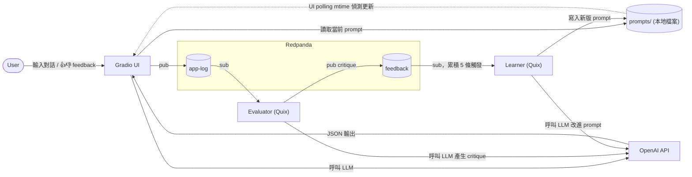
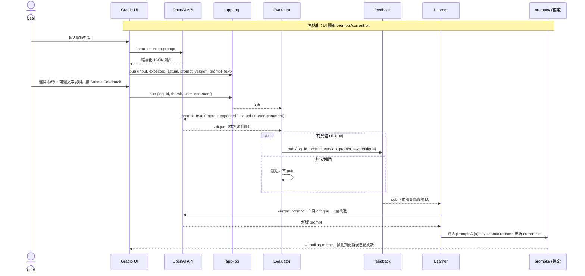

# Prompt Learning Flywheel — POC Plan

## 目標

驗證「LLM application 可以透過自動化流程持續改進自身 prompt」這個概念。

Demo 場景：客服對話 → 結構化 JSON 擷取。初始 prompt 粗糙，flywheel 跑數輪後，prompt 自動演化，輸出品質可觀察地提升。

---

## 架構總覽



### 資料流



---

## 技術棧

| Component | 技術 | 說明 |
|-----------|------|------|
| LLM | OpenAI API (gpt-4o-mini) | 便宜快速，POC 夠用 |
| LLM App UI | Gradio | 展示 + 人工測試 |
| 流處理平台 | Redpanda (Docker) | 單節點，2 個 topic |
| 流處理框架 | Quix Streams (Python) | 兩個 processor |
| Prompt Store | 本地檔案 (prompts/) | 零 infra，atomic rename 避免 race condition |
| 套件管理 | uv + pyproject.toml | `uv add` 安裝套件，`uv run` 執行腳本 |

---

## Components 細節

### 1. Redpanda (Docker)

**Topics:**

| Topic | Key | 用途 |
|-------|-----|------|
| `app-log` | UUID | LLM app 的每次呼叫紀錄 |
| `feedback` | UUID | evaluator 產生的 critique |

**app-log message schema:**
```json
{
  "id": "uuid",
  "timestamp": "ISO8601",
  "prompt_version": "v1",
  "input": "客服對話原文...",
  "expected_output": { ... },
  "actual_output": { ... }
}
```

**feedback message schema:**
```json
{
  "id": "uuid",
  "log_id": "ref to app-log id",
  "prompt_version": "v1",
  "prompt_text": "分析以下客服對話，輸出 JSON...",
  "thumb": "up | down | null",
  "user_comment": "category 分類完全錯了",
  "critique": "prompt 未定義 category 的可選值，導致模型輸出自由格式類別而非標準分類；也未給 sentiment 範例，造成情緒標籤不一致。"
}
```

**prompt store 檔案結構:**
```
prompts/
├── v1.prompt.md   # 初始 prompt 純文字
├── v2.prompt.md
├── current.prompt.md  # atomic rename 更新，UI polling 此檔的 mtime
```

### 2. Gradio App

**功能：**
- 顯示當前 prompt 版本與內容 (唯讀)
- 輸入客服對話 → 呼叫 OpenAI → 顯示 JSON 輸出
- 顯示 expected output 供比對
- 提供 👍👎 Radio 選擇 + 可選文字說明，按 Submit Feedback 一次送出 (pub 到 app-log topic)
- 版本歷史列表 (version, timestamp)
- Prompt diff 檢視 (v(n-1) → v(n))
- 一鍵「Run All Test Cases」按鈕，批次跑 golden set

**Prompt 讀取機制：**
- gr.Timer 每 2 秒檢查 `prompts/current.prompt.md` 的 mtime
- 有變動就讀取新版，更新 UI

### 3. Quix Evaluator

**輸入：** sub `app-log` topic
**輸出：** pub 到 `feedback` topic

**邏輯 (LLM-based)：**

Evaluator 拿到 `prompt_text` + `input` + `expected` + `actual`（若為人工 feedback 則額外有 `user_comment`），呼叫 LLM 分析「這個 prompt 哪裡不夠清楚，導致輸出偏離 expected」，輸出純文字 critique。

critique 應具體指出 prompt 的問題（例如：未限定 category 選項、未定義 sentiment 格式、缺乏輸出範例等），而非單純描述輸出結果的對錯。

若 LLM 無法從資訊中判斷 prompt 有何具體問題，則不 pub feedback，直接跳過。

### 4. Quix Learner

**輸入：** sub `feedback` topic
**觸發條件：** 累積 5 條 feedback

**流程：**
1. 收集 5 條 feedback (含 critique 文字)
2. 讀取當前 prompt (從本地快取)
3. 組裝 meta-prompt 給 OpenAI：

```
你是一個 prompt engineer。以下是當前 prompt 和它最近 5 次被觀察到的問題。
請根據這些問題，產生改進後的 prompt。

當前 prompt:
{current_prompt}

觀察到的問題：
1. {critique_1}
2. {critique_2}
3. {critique_3}
4. {critique_4}
5. {critique_5}

請輸出改進後的完整 prompt，只輸出 prompt 本身。
```

4. 拿到 candidate prompt → 寫入 `prompts/v{n}.prompt.md`，atomic rename 覆蓋 `current.prompt.md`

---

## Golden Set (5 組)

預先準備，存在 `golden_set.json`，供 Gradio「Run All Test Cases」批次展示用。範例：

**Case 1: 簡單投訴**
```
Input: "我三天前下的單到現在還沒收到，訂單編號 A12345，你們到底在搞什麼？"
Expected: {
  "category": "物流問題",
  "sentiment": "憤怒",
  "summary": "客戶反映訂單 A12345 已下單三天未到貨",
  "suggested_action": "查詢物流狀態並回覆客戶"
}
```

**Case 2: 退款請求**
```
Input: "你好，我想退掉上週買的藍牙耳機，還沒拆封，可以全額退款嗎？"
Expected: {
  "category": "退款申請",
  "sentiment": "中性",
  "summary": "客戶要求退還未拆封的藍牙耳機並請求全額退款",
  "suggested_action": "確認退貨政策並引導退貨流程"
}
```

**Case 3: 產品諮詢**
```
Input: "請問你們的年度會員跟月費會員差在哪裡？年度的有什麼額外優惠嗎？"
Expected: {
  "category": "產品諮詢",
  "sentiment": "中性",
  "summary": "客戶詢問年度會員與月費會員的差異及優惠",
  "suggested_action": "提供會員方案比較資訊"
}
```

**Case 4: 帳號問題 + 焦慮情緒**
```
Input: "我的帳號突然登不進去了，裡面還有儲值金耶！是不是被盜了？怎麼辦？"
Expected: {
  "category": "帳號安全",
  "sentiment": "焦慮",
  "summary": "客戶無法登入帳號，擔心帳號被盜及儲值金安全",
  "suggested_action": "協助帳號安全驗證並檢查異常登入紀錄"
}
```

**Case 5: 正面回饋 (edge case)**
```
Input: "上次客服小姐幫我處理得超快，想說來給你們一個好評！服務很棒！"
Expected: {
  "category": "正面回饋",
  "sentiment": "正面",
  "summary": "客戶對上次客服體驗表示滿意並給予好評",
  "suggested_action": "記錄正面回饋並轉達相關客服人員"
}
```

---

## 初始 Prompt (故意粗糙)

```
分析以下客服對話，輸出 JSON。
包含：category, sentiment, summary, suggested_action。
```

這個 prompt 故意不給範例、不限定 category 選項、不指定 sentiment 格式，讓飛輪有明確的改進空間。

---

## 專案結構

```
flywheel/
├── docker-compose.yml          # Redpanda（單節點 + Console + 自動建 topic）
├── pyproject.toml              # uv 套件管理 (uv add / uv run)
├── golden_set.json             # 5 組 test cases
│
├── prompts/                    # Prompt store (本地檔案)
│   ├── v1.prompt.md            # 初始 prompt
│   └── current.prompt.md       # 永遠指向最新版（atomic rename 更新）
│
├── lib/
│   └── prompt_manager.py       # Prompt store 讀寫模組
│
├── app/
│   └── gradio_app.py           # Gradio UI + OpenAI 呼叫
│
├── processors/
│   ├── evaluator.py            # Quix: app-log → feedback
│   └── learner.py              # Quix: feedback → 寫入 prompts/
│
└── docker-compose/             # (參考用) Redpanda 官方 quickstart 範例
```

---

## 實作順序

### Phase 1: 基礎建設 (Day 1) ✅ DONE

1. ✅ `docker-compose.yml` 啟動 Redpanda（單節點，無 SASL）
2. ✅ 建立 2 個 topics (`app-log`, `feedback`)；prompt store 改用本地檔案，不需要 `prompt-store` topic
3. ✅ 寫 `lib/prompt_manager.py`，讀寫 `prompts/` 目錄（read_current, save_new_version, list_versions, current_mtime）
4. ✅ 寫 `golden_set.json`（5 組 test cases）

### Phase 2: LLM App (Day 1-2) ✅ DONE

5. ✅ 寫 `gradio_app.py` 基本版：輸入 → OpenAI → 輸出
6. ✅ 加上 pub to app-log（Run 時暫存 log_id，Submit Feedback 時帶 thumb + comment 一次送出）
7. ✅ 加上從 prompt-store 讀取 prompt
8. ✅ 加上版本顯示、歷史、diff

### Phase 3: Evaluator (Day 2) ✅ DONE

9. ✅ 寫 evaluator.py：sub app-log → 算分 → pub feedback
10. ✅ 先用簡單規則 (JSON 格式 + 欄位比對)
11. ✅ 可選：加 embedding similarity 做 summary_quality

### Phase 4: Learner (Day 2-3)

12. 寫 learner.py：sub feedback → 累積 5 條 → 觸發
13. 組裝 meta-prompt → 呼叫 OpenAI → 拿到 candidate
14. 實作 eval gate：跑 golden set，比較分數
15. 通過 → pub 到 prompt-store

### Phase 5: 整合測試 (Day 3)

16. 端到端測試：在 Gradio 跑 test cases → 觀察飛輪轉動
17. 確認 Gradio UI 正確顯示版本更動
18. 跑 2-3 輪飛輪，驗證 prompt 確實在改進
19. 準備 demo script

---

## Demo 流程 (建議)

1. 展示初始 prompt (故意粗糙)
2. 在 Gradio 上用 golden set 跑一輪，展示初始分數偏低
3. 等待飛輪：evaluator 產生 feedback → learner 觸發 → 新 prompt 產生
4. Gradio UI 自動更新版本，展示 prompt diff
5. 再跑一輪 golden set，展示輸出品質提升
6. 重複 1-2 輪，展示持續改進
7. 討論：production 中如何加入人工 feedback、動態 eval pool、A/B test


